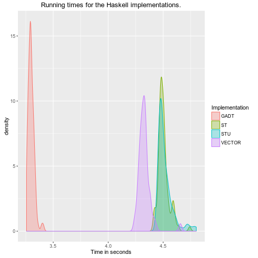
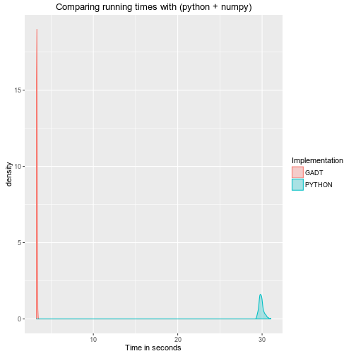

# "Haskell's stochastic gradient descent implementations comparation.

**date:** "2016-07-14"
**author:** "Aner Oscar Lucero"

## Method

I made three implementations of stochastic gradien descent(SGD) to train logistic
regression models.  SGD finds the optimal parameters for the model using one
example at a time, in constrast to batch-gradien descent which uses many samples
at once to train the model. SGD only requires to define vector dot product. The
implementations differ in the way I implemented the vectors.

In pseudo-haskell-code, SGD looks like:

```haskell
   model :: Vector (nFeatures + 1) Double
   features :: Vector (nFeatures) Double

   model := initial_model --Usually all zeros
   foreach example in examples:
      (features, target) := example
      prediction = hypotesis model features
      difference = prediction - target
      model = (model - learningRate * (difference * features + lambda * model'))

   where
   --here `dot` represents the scalar product
   hypotesis :: model -> features -> target
   hypotesis = 1 / ( 1 + exp (negate $ model `dot` (1 :- features)))
   model' = "model with it first element set to 0"
```

**GADTs**

The first implementation performs vector operations using:

```haskell
infixr 5 :-
data Vector :: Nat -> * -> * where
   Nil :: Vector 'Z a
   (:-) :: a -> Vector n a -> Vector ('S n) a

-- Inner product
{-# INLINE (%.) #-}
(%.) :: Num a => Vector ('S n) a -> Vector ('S n) a -> a
(%.) (a :- Nil) (b :- Nil) = a * b
(%.) (a :- as@(_ :- _)) (b :- bs@(_ :- _)) = a * b + (as %. bs)

```

The `foreach` part of the algorithm is handled by
```haskell
nextModel :: Num a =>
   a -> --lambda
   a -> --learningRate
   a -> --difference
   Vector ('S n) a -> --model
   Vector n a -> --Features
   Vector ('S n) a --the resulting model

nextModel lambda learningRate difference (m :- model) features =
   (m - learningRate * difference) :- nextModel' lambda learningRate difference model features

nextModel' :: Num a => a -> a -> a -> Vector n a -> Vector n a -> Vector n a
nextModel' _ _ _ Nil Nil = Nil
nextModel' lambda learningRate difference (m :- ms) (f :- fs) =
   (m - learningRate * (difference * f + lambda * m)) :- nextModel' lambda learningRate difference ms fs
```

with the hypotesis calculated as:

```haskell
sigmoidHypothesis :: Model -> Features -> Target
sigmoidHypothesis model features =
   1 / ( 1 + exp (negate $ model %. (1 :- features)))
```
The whole code can be found [here](../src/MainGADT.hs).

**MonadST, STArray & IArray**

The first implementation performs vector operations an IArray parametrized by
the its number of elements:

```haskell
data Vector :: Nat -> * where
   Vector :: SNat n -> Array Int Double -> Vector n
```

The `foreach` part of the algorithm and the hypothesis are handled by the
following imperative-syle code.

```haskell
nextModel lambda learningRate difference (Vector sn modelArr) (Vector _ featureArr) = Vector sn $ runSTArray $ do
   result <- newArray (1, nResultElements) 0 :: ST s (STArray s Int Double)
   writeArray result 1 $ (modelArr ! 1) - learningRate * difference
   forM_ [2..nResultElements] (\elementIndex ->
      do
         let modelElement = modelArr ! elementIndex
         let featureElement = featureArr ! (elementIndex - 1)
         writeArray result elementIndex $ modelElement - learningRate * (difference * featureElement + lambda * modelElement))
   return result
   where
   nResultElements = snatToInt sn

sigmoidHypothesis :: Model -> Features -> Target
sigmoidHypothesis (Vector sn modelArr) (Vector _ featuresArr) = runST $ do
   expo <- newSTRef $ modelArr ! 1
   forM_ [2..(snatToInt sn)] (\elementIndex ->
         modifySTRef expo (+ (modelArr ! elementIndex) * (featuresArr ! (elementIndex - 1))))
   readSTRef expo >>= \e -> return $ 1 / (1 + exp (negate e))
```

The whole code can be found [here](../src/MainST.hs).

**MonadST, STUArray & UArray**

According to the [wiki](https://wiki.haskell.org/Arrays#Unboxed_arrays), unboxed
arrays are a lighter version of IArray. It is also easy to change code using
`IArray` and `STArray` to start using `UArray` and `STUArray`.  This third
implementation does just that.

The whole code can be found [here](../src/MainSTU.hs).

**Python**

I also made a python-3.5.2 implementation to compare. This version uses the
[numpy](http://www.numpy.org/)-1.11.1 python library to perform the vector operations.

The code can be found [here](src/Main.py).

**Benchmark**

For each implementation I measured the time needed to train a model using
1,000,000 examples. This measurement is repeated 100 times to observe the
variations. The code performing this operation is found
[here](sh/poorManBenchmarTool.sh).

All code was compiled using `-O2`.

## Results

**Comparing haskell implementations**

```
## Loading required package: ggplot2
```



The GADT implementation is the best. Surprisingly, the STU is slightly worse
than ST.

Here are some summary statistics of the running times for each haskell
implementation.


```
##       GADT             ST             STU       
##  Min.   :3.256   Min.   :4.391   Min.   :4.410  
##  1st Qu.:3.280   1st Qu.:4.417   1st Qu.:4.449  
##  Median :3.296   Median :4.444   Median :4.491  
##  Mean   :3.299   Mean   :4.452   Mean   :4.487  
##  3rd Qu.:3.315   3rd Qu.:4.476   3rd Qu.:4.510  
##  Max.   :3.410   Max.   :4.594   Max.   :4.607
```

**Comparation to (python + numpy)**


My haskell implementation is 9 times faster than my python one.

Here are some summary statistics of the running times for both
implementation.


```
##       GADT           PYTHON     
##  Min.   :3.256   Min.   :29.42  
##  1st Qu.:3.280   1st Qu.:29.73  
##  Median :3.296   Median :29.86  
##  Mean   :3.299   Mean   :29.91  
##  3rd Qu.:3.315   3rd Qu.:30.02  
##  Max.   :3.410   Max.   :31.03
```
